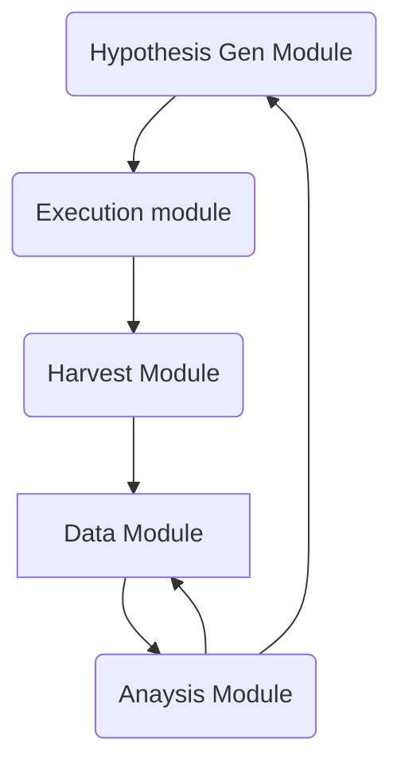

**Shorts Automation**

## System Design

### Inspirations:
 > https://github.com/anna-geller/dataflow-ops
 > https://medium.com/the-prefect-blog/declarative-dataflow-deployments-with-prefect-make-ci-cd-a-breeze-fe77bdbb58d4

### Should add better memaid:
https://mermaid.js.org/syntax/classDiagram.html

### Open Questions
Can I just do a local polling agent with prefect for the time being?
    No should figure out how to host via pulumi and have some version of anna's ci cd automation via gitlab
